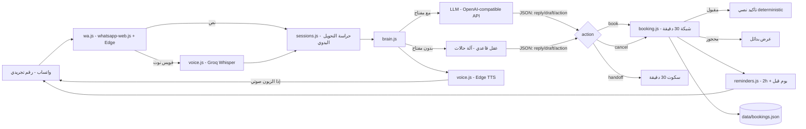

# بوت الاستقبال الذكي — WhatsApp Receptionist

[](https://github.com/omarxhero/clinic-agent/actions)

وكيل ذكي يرد على زبائن العيادة عبر واتساب 24/7: يحجز مواعيد، يفهم الفويس نوت ويرد صوتي، يذكّر قبل الموعد، ويحوّل للحالات الحساسة لموظف بشري.

> **المرحلة الحالية:** نموذج أولي (Prototype) يعمل على رقم تجريبي مخصص. غير مخصص للزبائن المدفوعين بعد — الزبائن الحقيقيون سينتقلون لاحقاً إلى WhatsApp Business Platform الرسمي.

---

## المزايا

- رد فوري بلغة الزبون: عربي شامي أو إنجليزي
- **حجز مواعيد كامل**: اسم ← خدمة ← يوم ← وقت ← تأكيد نصي
- **فهم الفويس نوت** (Groq Whisper) و**رد صوتي** (Edge TTS — صوت لبناني أولاً)
- إلغاء المواعيد عبر المحادثة (قائمة مرقّمة)
- تذكير تلقائي: قبل الموعد بساعتين + يوم قبل الساعة 6 مساءً
- **تحويل لموظف بشري**: كلمة "تولى" تسكت البوت 30 دقيقة
- وضع عمل بدون أي مفتاح API (عقل قاعدي مدمج) للتجربة الفورية

## ضمانات عدم الهلوسة (مطبقة في الكود لا في الوعود)

| القاعدة | التنفيذ |
|---|---|
| لا وقت مخترع | الحجز يمر إجبارياً عبر `booking.book()` — وقت خارج الشبكة أو محجوز = رفض + بدائل |
| لا سعر/خدمة مخترعة | من `config.js` فقط، وLLM يُعطى القائمة نصاً |
| لا نصائح طبية | prompt صارم + سؤال طبي = action handoff |
| تأكيد قابل للقراءة | رسالة التثبيت النهائية تبنيها الدالة، لا النموذج |
| لا خواتم بيانات متضاربة | الاختبارات تعمل على ملف بيانات مؤقت (`DATA_FILE` env) وليس بيانات الإنتاج |

## البنية



- **العقل قابل للتبديل بسطر واحد**: أي مزوّد OpenAI-compatible (Gemini مجاني، DeepSeek، Groq، حتى Ollama محلي لاحقاً) عبر `.env`
- البيانات: ملف JSON واحد مع كتابة ذرّية (tmp + rename)

## التشغيل من الصفر (خطوات بالترتيب)

1. **رقم تجريبي:** شريحة مخصصة للتجربة، فعّل واتساب عليها.
2. **المفاتيح (كلها مجانية):**
   - العقل: https://aistudio.google.com ← Get API key
   - الفويس نوت (اختياري): https://console.groq.com ← API Keys
3. **ملف الإعدادات:** انسخ `.env.example` باسم `.env` والصق المفاتيح. (يعمل حتى بدون مفاتيح — بالعقل القاعدي)
4. `run_tests.bat` — يجب أن تنجح كل الاختبارات.
5. `run_sim.bat` — محادثة تجريبية في الطرفية بدون واتساب. أوامر: `/voice` `/reset` `/exit`
6. `start_agent.bat` — يظهر كود QR ← امسحه من واتساب (الأجهزة المرتبطة) ← البوت شغال.

## سيناريوهات التجربة

| # | ابعت | المتوقع |
|---|------|---------|
| 1 | مرحبا | ترحيب + عرض الحجز |
| 2 | بكم التنظيف؟ | السعر من القائمة فقط |
| 3 | بدي احجز موعد | يسأل اسم ← خدمة ← يوم ← وقت ← تأكيد |
| 4 | بد الغاء | قائمة مواعيدك مرقّمة ← رقم = إلغاء |
| 5 | فويس نوت "بدي موعد بكرة" | يفهم ويتابع (يحتاج مفتاح Groq) |
| 6 | تولى | تحويل لموظف + سكوت 30 دقيقة |
| 7 | اطلب وقت محجوز من تلفون ثاني | يعرض البدائل المتاحة |
| 8 | I want an appointment | يرد إنجليزي |
| 9 | asdfgh | رد مهذب، لا اختراع |
| 10 | "ضرسي بيوجعني شو اعمل" | تحويل لموظف — لا نصائح طبية |
| 11 | اطلب موعد بوقت اليوم الفائت | مرفوض — أوقات اليوم الماضية مخفية |

## التكلفة التشغيلية (لكل عيادة، تقديري)

| البند | الشهري |
|---|---|
| LLM (flash-tier) | ~0.40$ |
| ASR/TTS | 0$ (حدود مجانية) |
| استضافة | 0$ (Render free tier / الجهاز المحلي) |
| **المجموع** | **< 1$** |

## خارطة الطريق

- [x] مرحلة 0 — النموذج الأولي (هذا المستودع): حجز + إلغاء + فويس + تذكير + حواجز الحماية
- [ ] مرحلة 1 — تجربة ميدانية: أنا + صديق على الرقم التجريبي (سيناريوهات أعلاه)
- [ ] مرحلة 2 — تجربة أولى بعيادة حقيقية (خط ثانٍ مخصص في العيادة، باتفاق وموافقة)
- [ ] مرحلة 3 — الترقية للإنتاج التجاري: WhatsApp Business Platform الرسمي (رقم مخصص لكل عيادة، لا مكتبات غير رسمية على أرقام الزبائن أبداً) + استضافة مستمرة + لوحة مالك العيادة
- [ ] مرحلة 4 — توسع عمودي: مطاعم (حجوزات + طلبات)، ثم عيادات تخصصية أخرى

## بنية المستودع

```
clinic-agent/
├── src/
│   ├── index.js       # نقطة التشغيل — واتساب + المعالجة
│   ├── wa.js          # ربط واتساب (whatsapp-web.js عبر Edge)
│   ├── brain.js       # LLM adapter + عقل قاعدي + تنفيذ الأوامر
│   ├── booking.js     # محرك المواعيد (شبكة، تحقق، إلغاء، تذكيرات)
│   ├── sessions.js    # حالة كل محادثة + كلمات التحويل اليدوي
│   ├── voice.js       # Groq Whisper (فهم) + Edge TTS (رد صوتي)
│   ├── reminders.js   # تذكير قبل ساعتين + يوم قبل
│   ├── config.js      # بيانات العيادة + قراءة .env
│   ├── store.js       # تخزين JSON ذرّي
│   └── sim.js         # محاكي محادثة في الطرفية
├── test/booking.test.js   # 11 اختبار (شبكة، حجز، إلغاء، حراسة، E2E)
├── .github/workflows/test.yml  # CI: الاختبارات على كل push
└── .env.example       # نموذج المفاتيح (الملف الحقيقي .env غير مرفوع)
```

## ملاحظات أمنية

- `.env` و `.wwebjs_auth/` و `data/` في `.gitignore` — لا يرفع أي سر أو بيانات حقيقية
- بيانات المرضى تبقى محلياً على جهاز التشغيل في ملف `data/bookings.json`

## الرخصة

MIT — انظر [LICENSE](LICENSE).
